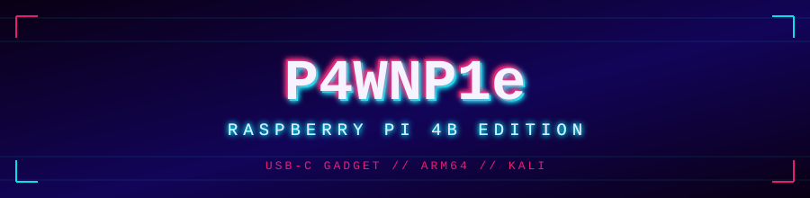

<p align="center">
  
</p>

<p align="center">
  
  
  
  
  <a href="LICENSE"></a>
</p>

<p align="center"><sub>
keyboard · mouse · network card · mass storage · wifi AP — one USB port,
switched at runtime over gRPC. born on the Pi Zero W, ported here to the Pi 4B.
</sub></p>

---

### `> WHAT THIS IS`

[**P4wnP1 A.L.O.A.**](https://github.com/RoganDawes/P4wnP1_aloa) turns a
Raspberry Pi into a composite USB gadget: HID injection, RNDIS/CDC-ECM
network takeover, USB mass storage, all controlled over gRPC/CLI/web UI.
Upstream targets the Pi Zero W only — ARMv6, single core, one USB port.

This fork ports the service daemon, CLI, GPIO, LED, Bluetooth, WiFi/nexmon,
and the gadget itself to the **Pi 4 Model B**. Full writeup with receipts:
[`PORTING.md`](PORTING.md).

```
┌──────────────────────────────────────────────────────────┐
│  USB-C  ──▶ dwc2 (peripheral)  ──▶ composite gadget       │
│              HID kbd/mouse · RNDIS · CDC-ECM · mass       │
│              storage · ACM serial — mix & match, live     │
│                                                            │
│  USB-A ×4 ─▶ still host mode — plug in wifi/storage/etc   │
│              *at the same time*. Pi Zero W never had that.│
└──────────────────────────────────────────────────────────┘
```

### `> WHAT CHANGED`

| upstream (Pi0W) | this fork (Pi4B) |
|---|---|
| out-of-tree dwc2 patch, one dead kernel branch | stock dwc2, polls `/sys/class/udc/*/state` |
| `periph.io` v3.3.0 — errors on unknown board rev | `periph.io/x/{conn,host}/v3` — real bcm2711 support |
| hand-built nexmon firmware, no CI, no maintainer | Kali's `brcmfmac-nexmon-dkms` + `firmware-nexmon`, apt-installed |
| GopherJS build needs a pinned Go + Kali-rolling container | WebUI ships prebuilt, unchanged — it's just JS |
| `led0` sysfs path hardcoded | probes `led0` then `ACT` (Pi4B's real DT label) |
| nexmon toggle wired to CLI/web UI, did nothing | swaps firmware or spins up `wlan0mon`, whichever the board supports |

### `> QUICKSTART`

```sh
# cross-compile the backend for arm64 — no special container needed
./build_support/pi4b/build.sh

# assemble a flashable image on Kali's official Pi arm64 image
# (ships DKMS nexmon out of the box)
sudo ./build_support/pi4b/image/build-image.sh

# flash it
xz -d build_support/pi4b/image/out/work/base.img.xz
sudo dd if=build_support/pi4b/image/out/work/base.img of=/dev/sdX bs=4M status=progress
```

First boot, run the smoke test — checks dwc2/UDC, every USB gadget kernel
module, GPIO, LED, Bluetooth, WiFi/nexmon, and every binary the backend
hard-depends on, in one pass:

```sh
sudo /usr/local/P4wnP1/verify-on-device.sh
```

### `> STATUS`

Backend builds clean, native, `linux/arm64`. Board-support gaps (GPIO, LED,
WiFi chip, dwc2) checked against kernel/device-tree/dependency source, not
folklore. Not yet confirmed: booting the assembled image on physical Pi4B
hardware — see [`PORTING.md`](PORTING.md) for the exact verified / unverified
split.

### `> NOT PORTED`

mame82's WiFi "covert channel" firmware (`dist/legacy/`,
`dist/scripts/wifi_covert_channel.sh`) is hand-written ARM-Thumb code against
the Pi0W's specific chip ROM. Pi4B has a different chip — porting it means
reverse-engineering a different ROM from scratch, not a mechanical port.
Left out, documented, not faked. Standard nexmon monitor mode / injection
works fine on either chip.

### `> AUTHORIZATION`

Physical-access implant. Hardware and networks you own or are explicitly
authorized to test, full stop. [`DISCLAIMER.md`](DISCLAIMER.md).

### `> CREDITS`

- [mame82](https://github.com/mame82) — original P4wnP1 A.L.O.A.
- [RoganDawes](https://github.com/RoganDawes) — upstream this fork branches from.
- This fork — Pi4B port. `git log pi4b-port` / [`PORTING.md`](PORTING.md) for the full diff and why.

<p align="center"><sub><code>░░░ every USB port is an attack surface ░░░</code></sub></p>
